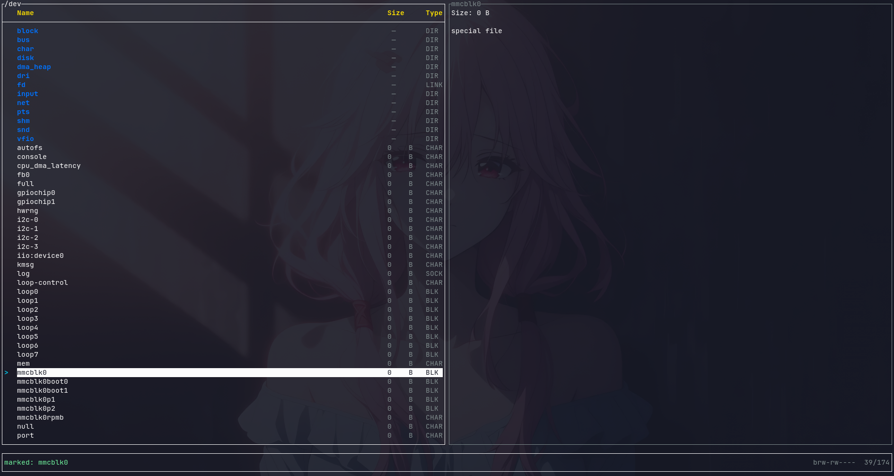

# npns
A weak, low-efficient TUI file system browser which is 
developed for poor nerds who want to learn embedded Linux but couldn't even afford an LCD screen (such as me).
Built in Rust, it's a no-frills tool for browsing files over serial consoles or minimal terminals—perfect for cross-compiling kernels on a shoestring budget.

## Preview


## Features
  - Supports most of the file operation, like Copy, Cut, Paste
  - could handle conflict file while pasting files
  - couldn't undo `delete`, because Trash dir may not exist
  - need not mouse, and arrow-key(bacause serial may unstable and truncate these keys(ANSI) into others)
  - probably crash if there are too many fils in current directory(but who will put that mamy of files in a single diectory on their board)
  - can work on my machine(seriously I.MX6ULL MINI)
  - about 100-200Kib under release mode

## Compile
Just compile it as how you compile other embedded rust projects. 

and the given config is used for Arm-Linux. Just run the following command

```
cargo +nightly build --release --target armv7-unknown-linux-musleabihf
```

## Keybindings
| Key       | Action                  | Notes                                |
|-----------|-------------------------|--------------------------------------|
| /         | Search                  | Search Files                         |
| .         | Hide                    | Toggle visibility for hidden files   | 
| j   k     | Down / Up               | Cycle rows                           |
| h         | Parent directory        | `cd ..` equivalent                   |
| l   Enter | Enter dir / Select file | Resets selection to 0 on enter       |
| Space     | Select current          | Toggle Selection                     |
| c   x     | Copy / Cut file         | To clipboard                         |
| v         | Paste                   | From clipboard to current/target dir |
| d         | Delete                  | Unrecoverable                        |
| n   m     | New file / New dir      | Enter name in input mode             |
| r         | Rename selected         | Pre-fills name in input mode         |
| u         | Undo last operation     | Most ops                             |
| q   Esc   | Quit / Cancel input     | Escape hatches everywhere            |
